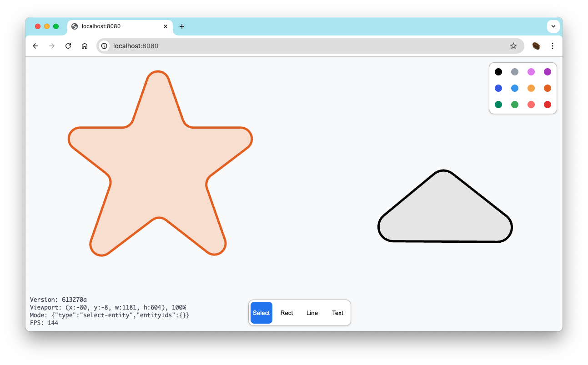

# Drawing



## 目標・方針

以下の要素を満たす、情報整理ツール

- [tldraw](https://tldraw.dev/)よりフォーマルな図をかきたい
    - アーキテクチャ図・ネットワーク図
    - 数学的な概念の図

- [Illustrator](https://www.adobe.com/jp/products/illustrator.html)や[figma](https://www.figma.com/)より気軽に使いたい
    - ページにアクセスすればすぐに始められる
    - UIをなるべくシンプルにし圧迫感をなくす

- [Notion](https://www.notion.so/)や[OneNote](https://www.microsoft.com/microsoft-365/onenote)のような情報集積がしたい
    - ページをリンクし、関連情報を整理する
    - 複数ページを対象にした横断的な検索

## 開発

### 必要ツール

- [bun](https://bun.sh/)

```bash
# 依存パッケージのインストール
$ bun install

# ローカルでの起動
$ cd ./packages/main
$ bun run start
```

## Contribution

- 誰でも歓迎です
- 趣味プロジェクトのため設計がコロコロ変わる可能性がありますが許してください